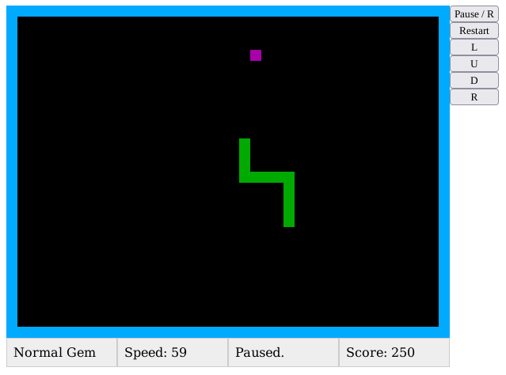

# The Classic Snake Game in Browser

This is a quick implementation of the classic snake game in HTML and JavaScript.
Took only a couple of hours and 300 lines of code.

Features:

* Gems with and without timeout
* Snake grows as it grabs gems
* Speed increases as you score
* Game over on colliding with the walls or self
* Navigation with arrow keys or mouse
* Can be paused

